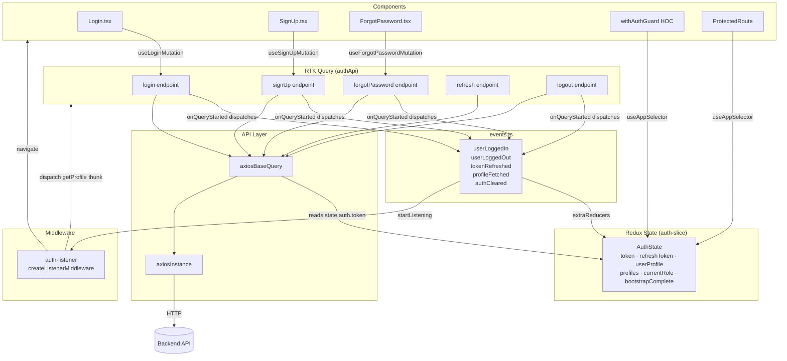
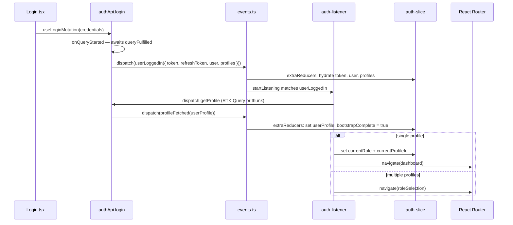
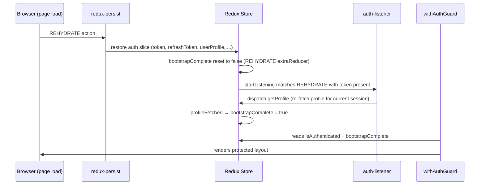
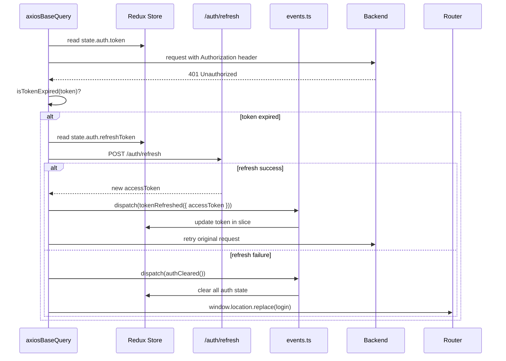

# Design Document — auth-refactor

## Overview

The auth-refactor brings `src/features/auth/` into full compliance with the project's architecture
rules (agent.md). The core goals are:

- **Isolate auth as a security domain**: `authApi` stays as a standalone `createApi` with its own
  `reducerPath`, cache, and middleware — never merged into `baseApi`.
- **Event-driven state**: Auth lifecycle changes are expressed as past-tense Redux action creators
  in `events.ts`; the slice listens via `extraReducers`.
- **Side-effect-free components**: Navigation, token hydration, and profile fetching move out of
  components and into `onQueryStarted` handlers and a `createListenerMiddleware` listener.
- **Single token source of truth**: `axiosInstance` stops reading from `localStorage`; the token
  is injected by `axiosBaseQuery` from `state.auth.token`.
- **Bootstrap gate**: A `bootstrapComplete` flag in `AuthState` prevents the app shell from
  rendering until profile resolution is done.
- **Wired stubs**: `ForgotPassword` and `SignUp` are connected to real RTK Query mutations.

---

## Architecture

### High-Level Data Flow



### Post-Login Bootstrap Event Chain



### Page Refresh — Rehydration Flow

`redux-persist` is configured with `whitelist: ["auth"]`, so the entire `auth` slice is
serialised to `localStorage` and rehydrated on every page load. This means `state.auth.token`
is available immediately after the store initialises — `axiosBaseQuery` can inject the
`Authorization` header on the very first request without any extra work.



**Critical detail — `bootstrapComplete` on rehydration:**

`bootstrapComplete` is persisted as `true` from the previous session. On page refresh, the
`REHYDRATE` action must reset it to `false` so the app shell waits for a fresh profile fetch
before rendering. The `auth-listener` registers a second listener on `REHYDRATE` that:

1. Checks `state.auth.token` is present and not expired
2. Re-dispatches a `getProfile` call
3. On success → `profileFetched` → `bootstrapComplete = true`
4. On failure (token expired, network error) → `authCleared` → redirect to login

This ensures the app never renders stale profile data from a previous session.

**`auth-slice.ts` — REHYDRATE handling:**

```ts
import { REHYDRATE } from 'redux-persist'

extraReducers: (builder) => {
  builder
    // ... other cases
    .addCase(REHYDRATE, (state, action: AnyAction) => {
      // Reset bootstrapComplete so the listener re-fetches profile
      if (action.payload?.auth) {
        return { ...action.payload.auth, bootstrapComplete: false }
      }
    })
}
```

**`auth-listener.ts` — REHYDRATE listener:**

```ts
import { REHYDRATE } from 'redux-persist'

authListenerMiddleware.startListening({
  type: REHYDRATE,
  effect: async (_action, listenerApi) => {
    const state = listenerApi.getState() as RootState
    const { token } = state.auth
    if (!token || isTokenExpired(token)) return  // guard will handle redirect
    // Re-fetch profile to confirm session is still valid
    // On success: dispatch(profileFetched(profile))
    // On failure: dispatch(authCleared())
  }
})
```

### Token Refresh Flow



---

## Components and Interfaces

### File-by-File Change Summary

| File | Change |
|------|--------|
| `src/features/auth/types.ts` | NEW — all auth domain types |
| `src/features/auth/events.ts` | NEW — event-driven action creators |
| `src/features/auth/api/auth-api.ts` | MOVED from root; adds `forgotPassword`, `signUp`, `onQueryStarted` handlers |
| `src/features/auth/state/auth-slice.ts` | UPDATED — adds `bootstrapComplete`, listens to events via `extraReducers` |
| `src/features/auth/state/auth-listener.ts` | NEW — `createListenerMiddleware` for post-login bootstrap |
| `src/features/auth/use-auth-state.ts` | RENAMED/REFACTORED from `use-auth.ts` — thin read-only selector |
| `src/features/auth/with-auth-guard.tsx` | UPDATED — reads only from `useAppSelector(state => state.auth)` |
| `src/features/auth/index.ts` | CLEANED — exports only public surface |
| `src/features/auth/components/Login.tsx` | UPDATED — pure form, calls `useLoginMutation` only |
| `src/features/auth/components/SignUp.tsx` | UPDATED — wired to `useSignUpMutation` |
| `src/features/auth/components/ForgotPassword.tsx` | UPDATED — wired to `useForgotPasswordMutation` |
| `src/app/api/axiosInstance.ts` | UPDATED — remove `localStorage` interceptor |
| `src/app/store.ts` | UPDATED — wire `authListenerMiddleware` |
| `src/features/auth/auth-api.ts` | DELETED — replaced by `api/auth-api.ts` |
| `src/features/auth/use-auth.ts` | DELETED — replaced by `use-auth-state.ts` |
| `src/features/auth/use-auth-slice.ts` | DELETED — dispatch wrappers move to `onQueryStarted` / listener |
| `src/features/auth/mock-auth.ts` | OUT OF SCOPE |
| `src/app/routing/protected-route.tsx` | PRESERVED as-is |

### Public API — `src/features/auth/index.ts`

```ts
// Slice
export { authReducer } from './state/auth-slice'
export type { AuthState } from './state/auth-slice'
export * from './state/auth-slice'   // selectors

// Events
export * from './events'

// Types
export * from './types'

// Guard
export { default as withAuthGuard } from './with-auth-guard'
```

Components (`Login`, `SignUp`, `ForgotPassword`) are consumed via lazy router imports only — not
re-exported from `index.ts`. RTK Query hooks are imported directly from
`@/features/auth/api/auth-api`.

### `withAuthGuard` Interface (tightened)

```ts
// Reads ONLY from store — no mutation hooks
const { token, isAuthenticated } = useAppSelector(state => state.auth)
const [refresh] = authApi.useRefreshMutation()
```

The guard no longer calls `useAuth()`. It reads `token` and `isAuthenticated` from the slice and
calls the `refresh` mutation directly when the token is expired.

---

## Data Models

### `AuthState` (updated)

```ts
interface AuthState {
  userProfile: UserProfile | null
  token: string | null
  refreshToken: string | null
  isAuthenticated: boolean
  profiles: SimpleUserProfile[]
  currentRole: UserRole | null
  currentProfileId: string | null
  bootstrapComplete: boolean   // NEW — true once profile fetch + role resolution done
}
```

`bootstrapComplete` starts as `false`. It is set to `true` by the `profileFetched` extraReducer
after the listener completes profile resolution. The app shell gates rendering on this flag.

### `types.ts` — Auth Domain Types

```ts
export type LoginRequest = { email: string; password: string }
export type LoginResponse = {
  token: string
  refresh_token?: string
  user?: UserProfile
  profiles?: SimpleUserProfile[]
}
export type SignUpRequest = { email: string; password: string }
export type SignUpResponse = { message?: string }
export type ForgotPasswordRequest = { email: string }
export type UserProfile = {
  id: string
  firstName?: string
  lastName?: string
  email: string
  role?: UserRole
  company?: { id: string; name: string; type?: string }
}
export type UserRole = { name: string; privileges?: string[] }
export type SimpleUserProfile = {
  profileId: string
  role: { name: string; description?: string }
  company: { id: string; name: string; type?: string }
}
export type TokenResponse = { accessToken?: string; refreshToken?: string }
```

### `events.ts` — Event Action Creators

```ts
import { createAction } from '@reduxjs/toolkit'
import type { LoginResponse, UserProfile, TokenResponse } from './types'

export const userLoggedIn   = createAction<LoginResponse>('auth/userLoggedIn')
export const userLoggedOut  = createAction('auth/userLoggedOut')
export const tokenRefreshed = createAction<TokenResponse>('auth/tokenRefreshed')
export const profileFetched = createAction<UserProfile>('auth/profileFetched')
export const authCleared    = createAction('auth/authCleared')
```

These are plain action creators — not slice reducers. The slice listens to them via `extraReducers`.

### `auth-slice.ts` — extraReducers wiring

```ts
extraReducers: (builder) => {
  builder
    .addCase(userLoggedIn, (state, action) => {
      state.token = action.payload.token
      state.refreshToken = action.payload.refresh_token ?? null
      state.userProfile = action.payload.user ?? null
      state.profiles = action.payload.profiles ?? []
      state.isAuthenticated = true
      state.bootstrapComplete = false  // reset until profile fetch completes
    })
    .addCase(profileFetched, (state, action) => {
      state.userProfile = action.payload
      state.bootstrapComplete = true
    })
    .addCase(tokenRefreshed, (state, action) => {
      state.token = action.payload.accessToken ?? state.token
      state.refreshToken = action.payload.refreshToken ?? state.refreshToken
    })
    .addCase(authCleared, () => initialState)
    .addCase(userLoggedOut, () => initialState)
}
```

### `auth-listener.ts` — Listener Middleware

```ts
import { createListenerMiddleware } from '@reduxjs/toolkit'
import { userLoggedIn } from '../events'
import { profileFetched, authCleared } from '../events'
import { setCurrentRole, setCurrentProfileId } from './auth-slice'
import { appPaths } from '@/app/routing/app-path'

export const authListenerMiddleware = createListenerMiddleware()

authListenerMiddleware.startListening({
  actionCreator: userLoggedIn,
  effect: async (action, listenerApi) => {
    const { profiles } = action.payload
    // Fetch profile (dispatch RTK Query or thunk)
    // On success: dispatch(profileFetched(profile))
    // Set role/profileId if single profile
    // Navigate based on profile count
  }
})
```

---

## Correctness Properties

*A property is a characteristic or behavior that should hold true across all valid executions of a
system — essentially, a formal statement about what the system should do. Properties serve as the
bridge between human-readable specifications and machine-verifiable correctness guarantees.*

### Property 1: Login handler hydrates slice and dispatches userLoggedIn

*For any* valid login response (with token, optional user, optional profiles), the `login`
endpoint's `onQueryStarted` handler SHALL dispatch `userLoggedIn` with the full payload AND the
resulting `AuthState` SHALL have `token`, `isAuthenticated: true`, and `profiles` matching the
response.

**Validates: Requirements 3.3, 5.2**

---

### Property 2: Token injection from store

*For any* non-null token value stored in `state.auth.token`, `axiosBaseQuery` SHALL include an
`Authorization: Bearer <token>` header on every outgoing request to a non-blacklisted path. When
`state.auth.token` is `null`, no `Authorization` header SHALL be present.

**Validates: Requirements 6.2, 6.3**

---

### Property 3: X-TENANT header on every request

*For any* hostname that encodes a tenant identifier, `axiosBaseQuery` SHALL inject the `X-TENANT`
header derived from that hostname on every request, regardless of auth state.

**Validates: Requirements 6.4**

---

### Property 4: Navigation routing by profile count

*For any* login response, the post-login listener SHALL navigate to the dashboard when the
response contains exactly one profile (and set `currentRole` + `currentProfileId`), and SHALL
navigate to the role-selection route when the response contains more than one profile.

**Validates: Requirements 4.3, 4.4**

---

### Property 5: bootstrapComplete transitions correctly

*For any* auth session, `bootstrapComplete` SHALL be `false` immediately after `userLoggedIn` is
dispatched and SHALL become `true` only after `profileFetched` is dispatched with a valid
`UserProfile`.

**Validates: Requirements 4.5**

---

### Property 6: Profile fetch updates slice

*For any* `UserProfile` object returned by the profile endpoint, dispatching `profileFetched`
SHALL update `state.auth.userProfile` to that profile and set `bootstrapComplete` to `true`.

**Validates: Requirements 4.2**

---

### Property 7: Auth guard redirects unauthenticated users

*For any* `AuthState` where `isAuthenticated` is `false` or `token` is `null`, `withAuthGuard`
SHALL render a redirect to the login route rather than the wrapped component.

**Validates: Requirements 7.4**

---

### Property 8: RBAC access control

*For any* route path and any set of user privileges, `ProtectedRoute` SHALL allow access if and
only if `hasRouteReadAccess` returns `true` for that path and privilege set.

**Validates: Requirements 7.6**

---

### Property 9: Token refresh on 401 with expired token

*For any* request that returns HTTP 401 when `state.auth.token` is expired, `axiosBaseQuery`
SHALL attempt a refresh using `state.auth.refreshToken`. On refresh success, it SHALL dispatch
`tokenRefreshed`, update the slice, and retry the original request with the new token. On refresh
failure or absent `refreshToken`, it SHALL dispatch `authCleared` and redirect to login.

**Validates: Requirements 11.1, 11.2, 11.3**

---

### Property 10: Blacklisted paths are never retried

*For any* request URL that contains `/auth/login` or `/auth/refresh`, `axiosBaseQuery` SHALL NOT
attempt a token refresh or retry, even if the response is 401.

**Validates: Requirements 11.4**

---

### Property 11: Error messages propagate to components

*For any* API error response from `forgotPassword` or `signUp` mutations, the component SHALL
display the `message` field from the `ApiErrorResponse` — the error is never silently swallowed.

**Validates: Requirements 8.4, 9.4**

---

### Property 12: bootstrapComplete resets on page refresh (REHYDRATE)

*For any* persisted `AuthState` where `bootstrapComplete` was `true`, the `REHYDRATE` action
SHALL reset `bootstrapComplete` to `false` so the app shell waits for a fresh profile fetch
before rendering. After the profile is re-fetched successfully, `bootstrapComplete` SHALL
become `true` again.

**Validates: Requirements 4.5, 12.1, 12.2**

---

## Error Handling

### Login errors
The `login` mutation returns an `ApiErrorResponse` on failure. `Login.tsx` reads `isError` and
`error` from `useLoginMutation` and displays the message inline. No `try/catch` in the component.

### ForgotPassword / SignUp errors
Both components read `isError` and `error` from their respective mutation hooks. No `useState`
for loading or error — all state comes from RTK Query.

### Token refresh failure
`axiosBaseQuery` catches refresh errors, dispatches `authCleared`, and redirects to login. The
original request returns an error to the caller.

### Profile fetch failure
The `auth-listener` catches profile fetch errors and dispatches `authCleared` to prevent the app
from being stuck in a half-bootstrapped state.

### Guard refresh failure
`withAuthGuard` calls the `refresh` mutation. If it rejects, the guard redirects to login.

---

## Testing Strategy

### Dual Testing Approach

Both unit tests and property-based tests are required. They are complementary:

- **Unit tests** cover specific examples, integration points, and edge cases.
- **Property tests** verify universal invariants across randomly generated inputs.

### Unit Tests (Vitest + React Testing Library)

| Target | What to test |
|--------|-------------|
| `auth-slice` reducers | Each action produces the correct next state |
| `events.ts` | Action creators produce correct `type` strings |
| `withAuthGuard` | Redirects when unauthenticated; renders component when authenticated |
| `Login.tsx` | Renders loading state; renders error from hook; does not call `navigate` directly |
| `ForgotPassword.tsx` | Renders loading; renders error; renders success view |
| `SignUp.tsx` | Renders loading; renders error |
| `axiosBaseQuery` | Injects `Authorization` header; omits header when token is null; injects `X-TENANT` |
| `auth-listener` | Dispatches `profileFetched` after `userLoggedIn`; navigates correctly |

### Property-Based Tests (fast-check)

Property tests use [fast-check](https://github.com/dubzzz/fast-check) with a minimum of **100
iterations** per property. Each test is tagged with a comment referencing the design property.

Tag format: `// Feature: auth-refactor, Property <N>: <property_text>`

| Property | Generator inputs | Assertion |
|----------|-----------------|-----------|
| P1: Login hydrates slice | Arbitrary `LoginResponse` (random token, user, profiles) | `state.auth.token === response.token`, `isAuthenticated === true` |
| P2: Token injection | Arbitrary token string or null | Header present iff token non-null |
| P3: X-TENANT header | Arbitrary hostname strings | Header always present when tenant extractable |
| P4: Navigation by profile count | Arbitrary `LoginResponse` with 1 or N profiles | Navigate destination matches profile count |
| P5: bootstrapComplete transitions | Sequence: `userLoggedIn` then `profileFetched` | `false` → `true` transition |
| P6: Profile fetch updates slice | Arbitrary `UserProfile` | `state.auth.userProfile` equals input |
| P7: Guard redirects unauthenticated | Arbitrary unauthenticated `AuthState` | Redirect rendered |
| P8: RBAC access control | Arbitrary route + privilege set | Access iff `hasRouteReadAccess` returns true |
| P9: Refresh on 401 | Arbitrary expired token + refresh token | Retry with new token on success; `authCleared` on failure |
| P10: Blacklisted paths not retried | Arbitrary URL containing `/auth/login` or `/auth/refresh` | No refresh attempted |
| P11: Error propagation | Arbitrary `ApiErrorResponse` | Component displays `message` field |

Each correctness property MUST be implemented by a **single** property-based test.
