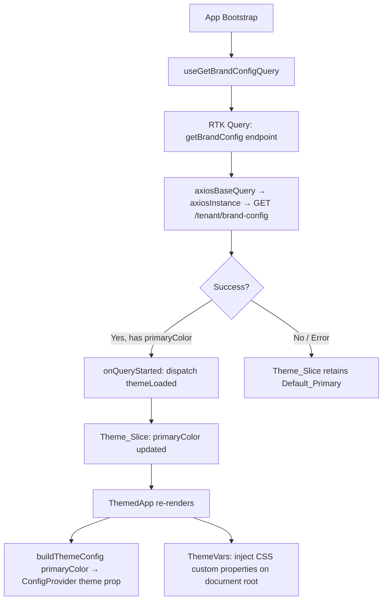
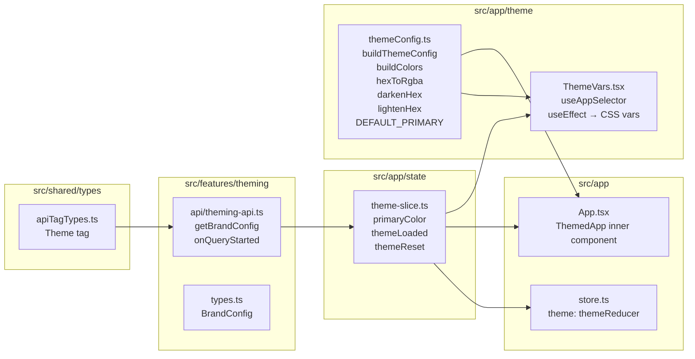

# Design Document: Dynamic Theming

## Overview

This feature replaces the hardcoded static theme in `src/config/theme.ts` with a runtime-reactive theming system. On app bootstrap, the application fetches the tenant's brand configuration from a backend API and applies the resolved `primaryColor` to Ant Design v5's `ConfigProvider` and to CSS custom properties — all without a page reload.

The design follows the project's feature-based, event-driven architecture: theming state lives in a Redux slice, the API call is an RTK Query endpoint injected into `baseApi`, and side effects are handled exclusively in `onQueryStarted`. No axios calls or data-fetching `useEffect` hooks appear in any React component.

### Key Design Decisions

- **Ant Design v5 reactive theming**: `ConfigProvider` accepts a reactive `theme` prop. Passing `buildThemeConfig(primaryColor)` — where `primaryColor` is read from the Redux store — causes all Ant Design components to re-render with the new color automatically when the store updates.
- **Redux slice for UI state**: `primaryColor` is global UI state (not server state), so it belongs in a Redux slice, not in RTK Query cache.
- **`ThemedApp` inner component**: Because `useAppSelector` cannot be called outside the Redux `Provider`, a `ThemedApp` component is rendered inside `Provider` to read the store and pass the reactive theme to `ConfigProvider`.
- **CSS custom properties via `ThemeVars`**: Non-Ant Design elements receive brand colors through CSS variables injected on `document.documentElement`. The `useEffect` in `ThemeVars` is a DOM side effect (not data fetching), which is permitted.
- **Migration, not duplication**: `src/config/theme.ts` is deleted; all utilities and config move to `src/app/theme/themeConfig.ts`.

---

## Architecture





---

## Components and Interfaces

### `src/app/state/theme-slice.ts`

Redux slice holding global theme UI state.

```ts
interface ThemeState {
  primaryColor: string  // initialized to DEFAULT_PRIMARY = "#006747"
}

// Actions
themeLoaded(primaryColor: string): void
themeReset(): void
```

### `src/app/theme/themeConfig.ts`

Single source of truth for Ant Design theme configuration and color utilities. Replaces `src/config/theme.ts`.

```ts
export const DEFAULT_PRIMARY = "#006747"

export function hexToRgba(hex: string, alpha: number): string
export function darkenHex(hex: string, amount: number): string
export function lightenHex(hex: string, amount: number): string

export function buildColors(primaryColor: string): Colors
export function buildThemeConfig(primaryColor: string): ThemeConfig
```

`buildThemeConfig` computes all color-derived tokens (`headerBg`, `siderBg`, `siderHover`, `itemSelectedColor`) from the provided `primaryColor`. All non-color tokens (`borderRadius`, `fontFamily`, `fontSize`, `controlHeight`, component overrides) remain identical to the original `src/config/theme.ts`.

### `src/app/theme/ThemeVars.tsx`

Reads `primaryColor` from the Redux store and injects CSS custom properties on `document.documentElement`. The `useEffect` is a DOM side effect, not data fetching.

```tsx
function ThemeVars(): null
```

CSS variables injected:
- `--color-primary` = `primaryColor`
- `--color-primary-dark` = `darkenHex(primaryColor, 0.18)`
- `--color-primary-darker` = `darkenHex(primaryColor, 0.32)`
- `--color-primary-light` = `lightenHex(primaryColor, 0.28)`
- `--color-primary-lighter` = `lightenHex(primaryColor, 0.5)`

### `src/features/theming/api/theming-api.ts`

RTK Query endpoints injected into `baseApi`.

```ts
getBrandConfig: builder.query<BrandConfig, void>({
  query: () => ({ url: '/tenant/brand-config', method: 'GET' }),
  providesTags: [ApiTagTypes.Theme],
  async onQueryStarted(_arg, { dispatch, queryFulfilled }) {
    try {
      const { data } = await queryFulfilled
      if (data.primaryColor) {
        dispatch(themeLoaded(data.primaryColor))
      }
    } catch { /* retain Default_Primary */ }
  }
})

export const { useGetBrandConfigQuery } = themingApi
```

### `src/features/theming/types.ts`

```ts
export type BrandConfig = {
  primaryColor: string
  logoUrl?: string
  tenantName?: string
}
```

### `src/App.tsx` — `ThemedApp` inner component

`ThemedApp` is rendered inside `Provider` so it can call `useAppSelector`. It reads `primaryColor` from the store, calls `useGetBrandConfigQuery` to trigger the bootstrap fetch, and passes the reactive theme to `ConfigProvider`.

```tsx
function ThemedApp() {
  const primaryColor = useAppSelector(state => state.theme.primaryColor)
  useGetBrandConfigQuery()  // fires on mount; RTK Query handles caching/dedup
  return (
    <ConfigProvider theme={buildThemeConfig(primaryColor)}>
      <ThemeVars />
      <AppRouter />
    </ConfigProvider>
  )
}

function App() {
  return (
    <Provider store={store}>
      <PersistGate loading={null} persistor={persistor}>
        <ThemedApp />
      </PersistGate>
    </Provider>
  )
}
```

### `src/shared/types/apiTagTypes.ts`

Add `Theme: "Theme"` to the `ApiTagTypes` const object.

---

## Data Models

### ThemeState (Redux)

```ts
{
  primaryColor: string  // e.g. "#006747"
}
```

Initialized to `DEFAULT_PRIMARY`. Updated by `themeLoaded`. Reset by `themeReset`. Never holds raw API response objects.

### BrandConfig (API response)

```ts
{
  primaryColor: string   // required — hex color string
  logoUrl?: string       // optional tenant logo
  tenantName?: string    // optional tenant display name
}
```

### Colors (derived, internal)

```ts
{
  primary: string
  primaryDark: string
  primaryDarker: string
  primaryLight: string
  primaryLighter: string
  // ... static semantic colors (success, error, warning, etc.)
  headerBg: string
  siderBg: string
  siderHover: string
}
```

### File Change Summary

| File | Change |
|------|--------|
| `src/app/theme/themeConfig.ts` | REPLACED — exports `buildThemeConfig`, `buildColors`, `hexToRgba`, `darkenHex`, `lightenHex`, `DEFAULT_PRIMARY` |
| `src/app/theme/ThemeVars.tsx` | UPDATED — reads `primaryColor` from store, injects CSS vars |
| `src/app/state/theme-slice.ts` | NEW — `primaryColor` state, `themeLoaded`, `themeReset` actions |
| `src/features/theming/api/theming-api.ts` | NEW — `getBrandConfig` query injected into `baseApi` |
| `src/features/theming/types.ts` | NEW — `BrandConfig` type |
| `src/app/store.ts` | UPDATED — add `theme: themeReducer` to `rootReducer` |
| `src/App.tsx` | UPDATED — `ThemedApp` inner component reads `primaryColor`, passes to `ConfigProvider` |
| `src/shared/types/apiTagTypes.ts` | UPDATED — add `Theme: "Theme"` |
| `src/config/theme.ts` | DELETED — replaced by `src/app/theme/themeConfig.ts` |

---

## Correctness Properties

*A property is a characteristic or behavior that should hold true across all valid executions of a system — essentially, a formal statement about what the system should do. Properties serve as the bridge between human-readable specifications and machine-verifiable correctness guarantees.*

### Property 1: themeLoaded round-trip

*For any* valid hex color string, dispatching `themeLoaded(color)` to the Redux store should result in `state.theme.primaryColor` equaling that color.

**Validates: Requirements 2.2, 3.4**

### Property 2: themeReset restores default

*For any* Redux store state where `primaryColor` has been set to an arbitrary value via `themeLoaded`, dispatching `themeReset` should result in `state.theme.primaryColor` equaling `DEFAULT_PRIMARY` (`#006747`).

**Validates: Requirements 2.3**

### Property 3: buildThemeConfig colorPrimary matches input

*For any* valid hex color string passed to `buildThemeConfig`, the returned `ThemeConfig`'s `token.colorPrimary` should equal that input color string.

**Validates: Requirements 3.1, 3.4**

### Property 4: buildThemeConfig derived tokens are consistent

*For any* valid hex color string passed to `buildThemeConfig`, the color-derived component tokens (`Layout.headerBg`, `Layout.siderBg`, `Menu.itemSelectedColor`) should be computed from that `primaryColor` using `darkenHex` and `lightenHex` — not from any hardcoded constant.

**Validates: Requirements 3.2**

### Property 5: ThemeVars injects all CSS variables correctly

*For any* valid hex `primaryColor` value in the Redux store, after `ThemeVars` renders, the CSS custom properties on `document.documentElement` should satisfy:
- `--color-primary` equals `primaryColor`
- `--color-primary-dark` equals `darkenHex(primaryColor, 0.18)`
- `--color-primary-darker` equals `darkenHex(primaryColor, 0.32)`
- `--color-primary-light` equals `lightenHex(primaryColor, 0.28)`
- `--color-primary-lighter` equals `lightenHex(primaryColor, 0.5)`

**Validates: Requirements 4.1, 4.2, 4.3, 4.4, 4.5, 4.7**

### Property 6: Non-color tokens preserved in migration

*For any* valid hex `primaryColor` value, the non-color tokens produced by `buildThemeConfig(primaryColor)` (e.g., `borderRadius`, `fontFamily`, `fontSize`, `controlHeight`, all component overrides) should equal the corresponding values from the original hardcoded `themeConfig` in `src/config/theme.ts`.

**Validates: Requirements 5.3, 5.5**

### Property 7: Successful brand config fetch dispatches themeLoaded

*For any* `BrandConfig` response containing a non-empty `primaryColor` field, the `onQueryStarted` handler of `getBrandConfig` should dispatch `themeLoaded` with that `primaryColor` value, resulting in the Redux store reflecting the fetched color. Edge cases: a failed request or a response missing `primaryColor` should leave the store at `DEFAULT_PRIMARY`.

**Validates: Requirements 1.2, 1.3, 1.4**

---

## Error Handling

| Scenario | Behavior |
|----------|----------|
| `GET /tenant/brand-config` returns a network error | `onQueryStarted` catch block runs silently; `Theme_Slice` retains `DEFAULT_Primary` |
| Response succeeds but `primaryColor` is absent or falsy | `if (data.primaryColor)` guard prevents dispatch; slice retains `DEFAULT_PRIMARY` |
| `primaryColor` is an invalid hex string | Passed through as-is; Ant Design and color utilities will produce degraded output — validation is out of scope for this feature |
| Redux store not yet hydrated (PersistGate loading) | `ThemedApp` is inside `PersistGate`, so `useGetBrandConfigQuery` fires only after rehydration |

---

## Testing Strategy

### Dual Testing Approach

Both unit tests and property-based tests are required. They are complementary:
- Unit tests cover specific examples, integration points, and error conditions.
- Property-based tests verify universal correctness across all valid inputs.

### Property-Based Testing

Use **fast-check** (TypeScript-native, works with Vitest) for property-based tests.

Each property test must run a minimum of **100 iterations**.

Each test must include a comment tag in the format:
`// Feature: dynamic-theming, Property N: <property_text>`

| Property | Test Description | Generator |
|----------|-----------------|-----------|
| P1 | `themeLoaded` round-trip | `fc.hexaString({ minLength: 6, maxLength: 6 }).map(h => '#' + h)` |
| P2 | `themeReset` restores default | Same hex generator, dispatch `themeLoaded` then `themeReset` |
| P3 | `buildThemeConfig` colorPrimary matches input | Same hex generator |
| P4 | `buildThemeConfig` derived tokens consistent | Same hex generator, verify `headerBg === darkenHex(color, 0.32)` |
| P5 | `ThemeVars` CSS variables | Same hex generator, render with RTL, check `document.documentElement.style` |
| P6 | Non-color token preservation | Same hex generator, compare non-color fields against known constants |
| P7 | API success dispatches `themeLoaded` | `fc.record({ primaryColor: hexGen })`, mock RTK Query, verify dispatch |

### Unit Tests

Focus on:
- Initial state of `theme-slice` equals `DEFAULT_PRIMARY` (Requirement 2.1)
- `buildThemeConfig` is callable and returns a valid `ThemeConfig` shape (Requirement 5.4)
- `ThemeVars` renders null (no DOM output beyond CSS vars)
- `getBrandConfig` endpoint URL is `/tenant/brand-config` with method `GET`
- Error path: failed API call leaves store at `DEFAULT_PRIMARY` (Requirement 1.3)
- Missing `primaryColor` in response leaves store at `DEFAULT_PRIMARY` (Requirement 1.4)

### Test File Locations

```
src/__tests__/
  theme-slice.test.ts          — unit + property tests for Redux slice
  themeConfig.test.ts          — unit + property tests for buildThemeConfig, color utilities
  ThemeVars.test.tsx            — property tests for CSS variable injection
  theming-api.test.ts           — unit tests for API endpoint behavior
```
