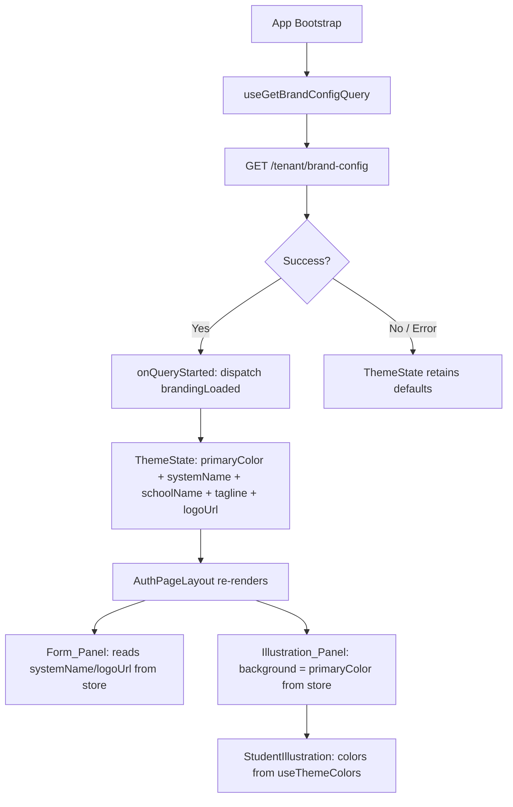
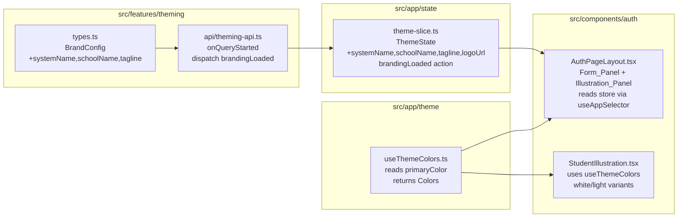

# Design Document: Login Revamp

## Overview

This feature replaces the current glassmorphism `AuthPageLayout` with a clean two-column split design. The left panel (Form_Panel, ~45%) is a white background containing the logo/brand name, welcome copy, and all auth form children. The right panel (Illustration_Panel, ~55%) is a solid `primaryColor` background with the `StudentIllustration` centered inside it.

The revamp also extends the dynamic theming system: `BrandConfig`, `ThemeState`, and the `onQueryStarted` handler are updated to carry `systemName`, `schoolName`, `tagline`, and `logoUrl` alongside `primaryColor`. `AuthPageLayout` reads all branding exclusively from the Redux store — the static `src/config/branding.ts` file is no longer referenced.

### Key Design Decisions

- **White form panel, solid color illustration panel**: The split creates a clear visual hierarchy — the form is calm and readable on white; the illustration panel is bold and on-brand.
- **All colors from Redux store**: `primaryColor` drives the illustration panel background and all derived color variants. No hex literals appear in `AuthPageLayout` or `StudentIllustration`.
- **Branding fields in Redux**: `systemName`, `schoolName`, `tagline`, `logoUrl` are stored in `ThemeState` alongside `primaryColor`. This keeps `AuthPageLayout` decoupled from any static config file and ensures branding updates from the API are reflected immediately.
- **`AuthIllustration` removed**: The old background SVG overlay is no longer needed — the solid `primaryColor` panel replaces it.
- **Responsive via CSS media queries**: The illustration panel is hidden on mobile using a CSS media query (or `useIsMobile` hook). No `window.resize` listeners.
- **`StudentIllustration` color inversion**: The illustration previously used `primary`, `primaryLight`, `primaryDark` on a light/transparent background. On a solid `primaryColor` background those colors disappear. The updated illustration uses `white`, `primaryLighter`, and `rgba(255,255,255,0.N)` variants for contrast.

---

## Architecture





---

## Components and Interfaces

### `AuthPageLayout` — `src/components/auth/AuthPageLayout.tsx`

Full redesign. Replaces the glassmorphism layout.

```tsx
interface AuthPageLayoutProps {
  children: React.ReactNode;
  illustration: "login" | "signup" | "reset"; // kept for future extensibility
}
```

Internal structure:

```
<div.auth-page>                          // flex row, 100vh, overflow-x: hidden
  <div.auth-form-panel>                  // flex: 0 0 45%, white bg, flex col
    <div.auth-form-panel__header>        // logo / systemName top-left
    <div.auth-form-panel__body>          // "Welcome back" + subtitle + children
    <div.auth-form-panel__footer>        // "Don't have an account? Sign up"
  </div>
  <div.auth-illustration-panel>         // flex: 0 0 55%, bg=primaryColor, hidden on mobile
    <StudentIllustration />
  </div>
</div>
```

Store reads (all via `useAppSelector`):
- `state.theme.primaryColor`
- `state.theme.systemName`
- `state.theme.logoUrl`

No `useEffect` hooks. No imports from `src/config/branding.ts`.

---

### `StudentIllustration` — `src/components/auth/StudentIllustration.tsx`

Color update only — no structural changes to the SVG paths.

Current color mapping → New color mapping:

| Element | Before | After |
|---------|--------|-------|
| `bookColor1` | `colors.primary` | `#ffffff` (white) |
| `bookColor2` | `colors.primaryLight` | `rgba(255,255,255,0.75)` |
| `bookColor3` | `colors.primaryDark` | `rgba(255,255,255,0.55)` |
| `accentColor` | `colors.info` | `rgba(255,255,255,0.35)` |
| Shadow `floodColor` | `c` (primary) | `rgba(0,0,0,0.25)` |
| Background gradient | `c` at 0.1 opacity | removed (panel bg handles it) |
| Open book fill | `#FFFFFF` | `rgba(255,255,255,0.15)` |
| Open book stroke | `cDark` | `rgba(255,255,255,0.6)` |
| Decorative circles/shapes | `cLight` / `cDark` | `rgba(255,255,255,0.2–0.4)` |

All values still derived from `useThemeColors()` where possible, or from `rgba(255,255,255,N)` constants for white-tinted elements. No hardcoded brand hex values.

---

### `src/features/theming/types.ts`

```ts
export type BrandConfig = {
  primaryColor: string;
  logoUrl?: string;
  tenantName?: string;
  systemName?: string;   // added
  schoolName?: string;   // added
  tagline?: string;      // added
};
```

---

### `src/app/state/theme-slice.ts`

Extended state and a new `brandingLoaded` action (or extend `themeLoaded` to accept a partial `BrandConfig` — see rationale below).

```ts
interface ThemeState {
  primaryColor: string;
  systemName: string | undefined;
  schoolName: string | undefined;
  tagline: string | undefined;
  logoUrl: string | undefined;
}

const initialState: ThemeState = {
  primaryColor: DEFAULT_PRIMARY,
  systemName: undefined,
  schoolName: undefined,
  tagline: undefined,
  logoUrl: undefined,
};
```

New action:

```ts
brandingLoaded(state, action: PayloadAction<Partial<BrandConfig>>): void
// Sets any provided fields; leaves others unchanged
```

Rationale for a separate `brandingLoaded` action rather than extending `themeLoaded`: `themeLoaded` currently accepts a plain `string` (the color). Changing its payload type would break existing callers and tests. A separate `brandingLoaded` action keeps the color update path unchanged and adds branding as an independent concern.

---

### `src/features/theming/api/theming-api.ts`

`onQueryStarted` dispatches both `themeLoaded` (color) and `brandingLoaded` (branding fields) when present:

```ts
async onQueryStarted(_arg, { dispatch, queryFulfilled }) {
  try {
    const { data } = await queryFulfilled;
    if (data.primaryColor) {
      dispatch(themeLoaded(data.primaryColor));
    }
    dispatch(brandingLoaded({
      systemName: data.systemName,
      schoolName: data.schoolName,
      tagline: data.tagline,
      logoUrl: data.logoUrl,
    }));
  } catch {
    // silent — slice retains defaults
  }
}
```

---

## Data Models

### `ThemeState` (Redux)

```ts
{
  primaryColor: string;          // e.g. "#006747", default DEFAULT_PRIMARY
  systemName: string | undefined; // e.g. "EduPortal", default undefined
  schoolName: string | undefined; // e.g. "Greenfield University", default undefined
  tagline: string | undefined;    // e.g. "Empowering learners", default undefined
  logoUrl: string | undefined;    // e.g. "https://cdn.example.com/logo.png", default undefined
}
```

### `BrandConfig` (API response)

```ts
{
  primaryColor: string;
  logoUrl?: string;
  tenantName?: string;
  systemName?: string;
  schoolName?: string;
  tagline?: string;
}
```

### Data Flow

```
GET /tenant/brand-config
  └─ onQueryStarted
       ├─ dispatch themeLoaded(data.primaryColor)      → state.theme.primaryColor
       └─ dispatch brandingLoaded({ systemName, ... }) → state.theme.{systemName,schoolName,tagline,logoUrl}
            └─ AuthPageLayout re-renders
                 ├─ Form_Panel: shows systemName / logoUrl
                 └─ Illustration_Panel: background = primaryColor
                      └─ StudentIllustration: colors from useThemeColors(primaryColor)
```

---

## Responsive Layout Specification

### Breakpoints

| Range | Layout |
|-------|--------|
| `< 768px` (mobile) | Form_Panel full-width, Illustration_Panel hidden |
| `768px – 1024px` (tablet) | Both panels; Form_Panel ≥ 50%, Illustration_Panel remainder |
| `> 1024px` (desktop) | Form_Panel ~45%, Illustration_Panel ~55% |

### CSS Structure

```css
/* Base (desktop) */
.auth-page {
  display: flex;
  flex-direction: row;
  min-height: 100vh;
  overflow-x: hidden;
}

.auth-form-panel {
  flex: 0 0 45%;
  background: #ffffff;
  display: flex;
  flex-direction: column;
  padding: 2rem;
  overflow-y: auto;        /* scrollable when keyboard open */
}

.auth-illustration-panel {
  flex: 1 1 55%;
  display: flex;
  justify-content: center;
  align-items: center;
  /* background set inline from store: primaryColor */
}

/* Tablet */
@media (max-width: 1024px) {
  .auth-form-panel { flex: 0 0 50%; }
  .auth-illustration-panel { flex: 1 1 50%; }
}

/* Mobile */
@media (max-width: 767px) {
  .auth-form-panel {
    flex: 1 1 100%;
    padding: 1.5rem;
    padding-top: 1.25rem;
    min-height: 100vh;
    justify-content: center;
  }
  .auth-illustration-panel {
    display: none;
  }
}
```

### Form Panel Internal Layout

```
┌─────────────────────────────────┐
│ [Logo / systemName]  top-left   │  ← pt ≥ 1.25rem (mobile), ≥ 1.5rem (desktop)
│                                 │
│                                 │
│   Welcome back          ← h1, ≥1.75rem desktop / ≥1.5rem mobile, font-weight 700
│   Please enter your details ← subtitle, ≥0.875rem
│                                 │
│   [form children]               │
│                                 │
│                                 │
│   Don't have an account?        │  ← centered, bottom
│   Sign up                       │
└─────────────────────────────────┘
```

### Mobile-Specific Rules

- All buttons: `width: 100%`
- All inputs: `width: 100%`
- Touch targets: `min-height: 44px` on all interactive elements
- Remember/forgot row: `display: flex; justify-content: space-between` — stacks only below 320px
- Form panel: `overflow-y: auto` — never `overflow: hidden`
- Heading: `font-size: clamp(1.5rem, 5vw, 2rem)` (scales between mobile min and desktop max)

---

## Color Strategy for Illustration on Dark Background

The `StudentIllustration` sits on a solid `primaryColor` background. The original colors (primary, primaryLight, primaryDark) are all variations of the same hue and will have poor contrast against the panel background.

### Strategy: White-tinted palette

All illustration elements switch to white or semi-transparent white:

```
Opaque white (#ffffff)          → main book shapes, high-contrast elements
rgba(255,255,255,0.75)          → secondary book shapes
rgba(255,255,255,0.55)          → tertiary/shadow book shapes
rgba(255,255,255,0.35)          → accent fills (open book pages)
rgba(255,255,255,0.2–0.4)       → decorative shapes, circles
rgba(0,0,0,0.25)                → drop shadow (neutral, works on any hue)
```

This approach:
- Works for any `primaryColor` hue (light or dark)
- Requires no contrast ratio calculation at runtime
- Keeps the illustration visually cohesive — white on color is a standard design pattern

The `useThemeColors()` hook is still called (for `primaryLighter` if needed for subtle tints), but the primary illustration elements use white constants.

---

## Migration Notes

### What Changes

| File | Change |
|------|--------|
| `src/features/theming/types.ts` | Add `systemName?`, `schoolName?`, `tagline?` to `BrandConfig` |
| `src/app/state/theme-slice.ts` | Add `systemName`, `schoolName`, `tagline`, `logoUrl` to `ThemeState`; add `brandingLoaded` action |
| `src/features/theming/api/theming-api.ts` | Dispatch `brandingLoaded` in `onQueryStarted` |
| `src/components/auth/AuthPageLayout.tsx` | Full redesign: two-column split, reads branding from store, removes `AuthIllustration`, removes `branding` import |
| `src/components/auth/StudentIllustration.tsx` | Color update: white/semi-transparent palette for dark background |

### What Stays the Same

- `AuthPageLayout` props interface (`children`, `illustration`) — no changes to callers
- `themeLoaded` action signature — still accepts `string`
- `useThemeColors()` hook — unchanged
- `ThemeVars.tsx` — unchanged
- `buildThemeConfig` / `buildColors` — unchanged
- All auth page components (login, signup, reset) — no changes needed; they pass children to `AuthPageLayout` as before
- `AuthIllustration` component file — kept in codebase but no longer imported by `AuthPageLayout`

---

## Correctness Properties

*A property is a characteristic or behavior that should hold true across all valid executions of a system — essentially, a formal statement about what the system should do. Properties serve as the bridge between human-readable specifications and machine-verifiable correctness guarantees.*

### Property 1: Form panel background is always white

*For any* `primaryColor` value in the Redux store, the Form_Panel rendered by `AuthPageLayout` should have a background color of `#ffffff`, independent of the active theme color.

**Validates: Requirements 1.2**

### Property 2: Illustration panel background matches store primaryColor

*For any* `primaryColor` value in the Redux store, the Illustration_Panel rendered by `AuthPageLayout` should have a background color equal to that `primaryColor`. When the store value changes, the panel background should update to match the new value (round-trip reactivity).

**Validates: Requirements 1.3, 4.3**

### Property 3: systemName from store appears in Form_Panel

*For any* `systemName` string value stored in the Redux `ThemeState`, the rendered Form_Panel should contain that string in its output.

**Validates: Requirements 2.1, 6.4**

### Property 4: children prop is rendered in Form_Panel

*For any* React children passed to `AuthPageLayout`, those children should appear in the rendered Form_Panel output.

**Validates: Requirements 2.4, 7.2**

### Property 5: brandingLoaded dispatches all present branding fields

*For any* `BrandConfig` API response that includes one or more of `systemName`, `schoolName`, `tagline`, `logoUrl`, the `onQueryStarted` handler should dispatch `brandingLoaded` such that the Redux store reflects all provided values after the dispatch.

**Validates: Requirements 6.3**

### Property 6: Graceful render with missing branding fields

*For any* partial `ThemeState` where `systemName`, `schoolName`, `tagline`, and/or `logoUrl` are `undefined`, `AuthPageLayout` should render without throwing an error and should produce valid output.

**Validates: Requirements 6.6**

---

## Error Handling

| Scenario | Behavior |
|----------|----------|
| `getBrandConfig` returns network error | `onQueryStarted` catch block runs silently; `ThemeState` retains `DEFAULT_PRIMARY` and `undefined` branding fields |
| Response missing `primaryColor` | `if (data.primaryColor)` guard prevents `themeLoaded` dispatch; color stays at `DEFAULT_PRIMARY` |
| Response missing branding fields | `brandingLoaded` dispatched with `undefined` values; store fields remain `undefined`; `AuthPageLayout` renders fallback (empty string / omits element) |
| `systemName` is `undefined` | Form_Panel renders without a logo/name element — no crash |
| `logoUrl` is `undefined` | Logo `` not rendered; `systemName` text used as fallback if present |
| `primaryColor` is an invalid hex | Passed through as-is; `buildColors` produces degraded output — out of scope for this feature |

---

## Testing Strategy

### Dual Testing Approach

Both unit tests and property-based tests are required and complementary:
- Unit tests cover specific examples, breakpoint behavior, and error conditions.
- Property-based tests verify universal correctness across all valid inputs.

### Property-Based Testing

Use **fast-check** (already available in the project via Vitest) for property-based tests.

Each property test must run a minimum of **100 iterations**.

Each test must include a comment tag:
`// Feature: login-revamp, Property N: <property_text>`

| Property | Test Description | Generator |
|----------|-----------------|-----------|
| P1 | Form panel background always white | `fc.hexaString({ minLength: 6, maxLength: 6 }).map(h => '#' + h)` — set as primaryColor, render, assert form panel bg = `#ffffff` |
| P2 | Illustration panel bg matches store | Same hex generator — set store, render, assert panel bg = color; then change store, assert panel updates |
| P3 | systemName appears in Form_Panel | `fc.string({ minLength: 1 })` — set as systemName in store, render, assert text present |
| P4 | children rendered in Form_Panel | `fc.string({ minLength: 1 })` — wrap in `<span>`, pass as children, assert present in output |
| P5 | brandingLoaded dispatches all fields | `fc.record({ systemName: fc.option(fc.string()), schoolName: fc.option(fc.string()), tagline: fc.option(fc.string()), logoUrl: fc.option(fc.string()) })` — mock dispatch, verify all fields set |
| P6 | Graceful render with undefined branding | `fc.record({ primaryColor: hexGen })` with all branding fields absent — render, assert no throw |

### Unit Tests

Focus on:
- Initial `ThemeState` has `systemName`, `schoolName`, `tagline`, `logoUrl` all `undefined`
- `brandingLoaded` action sets provided fields and leaves others unchanged
- `AuthPageLayout` renders "Welcome back" heading text
- `AuthPageLayout` renders "Please enter your details" subtitle text
- `AuthPageLayout` renders "Don't have an account? Sign up" link
- Illustration panel hidden at mobile viewport width (< 768px)
- Both panels visible at tablet/desktop viewport width (≥ 768px)
- Form panel has `overflow-y: auto` (not `overflow: hidden`)
- `AuthPageLayout` does not import from `src/config/branding.ts`
- `onQueryStarted` does not dispatch `brandingLoaded` on API error

### Test File Locations

```
src/__tests__/
  theme-slice.test.ts          — extend with brandingLoaded action tests
  theming-api.test.ts          — extend with branding dispatch tests
  AuthPageLayout.test.tsx      — new: layout, responsive, branding, property tests
```
