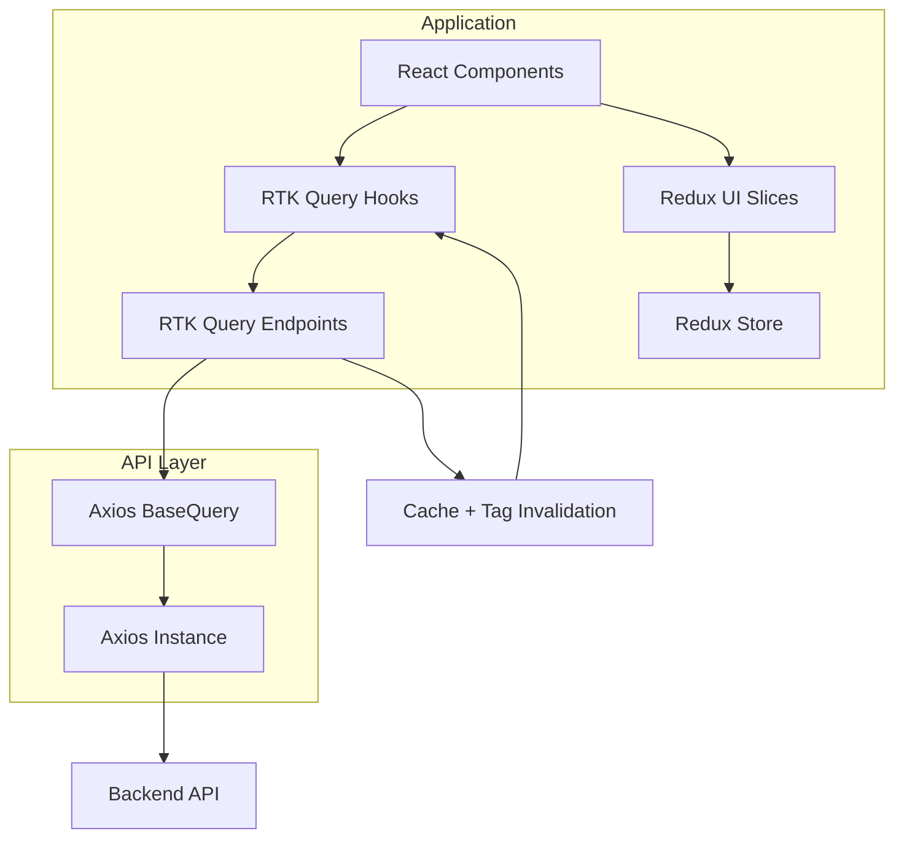

# AGENT.md — React Frontend Architecture Rules

This document defines **mandatory architectural rules** for generating and modifying frontend code.

The application uses:

- React
- Redux Toolkit
- RTK Query
- Axios
- Vite

Architecture principles:

```
Feature-based architecture
Domain-driven frontend
Event-driven UI
RTK Query for server state
Redux slices for client/UI state
Axios-powered API layer
```

---

# High-Level Architecture



---

# Project-Level vs Application-Level Configuration

## Project-Level (Repository Root)

These configure the build system.

```
vite.config.ts
tsconfig.json
package.json
eslint.config.js
```

---

## Application-Level

Lives inside:

```
src/app
```

Example:

```
src/app/
  store.ts
  routing/
  api/
    baseApi.ts
    axiosInstance.ts
    axiosBaseQuery.ts
```

---

# Source Structure

```
src/
  app/
  features/
  shared/
  assets/
  main.tsx
```

Responsibilities:

| Folder   | Responsibility             |
| -------- | -------------------------- |
| app      | application infrastructure |
| features | domain modules             |
| shared   | reusable utilities         |
| assets   | images/icons/fonts         |

---

# Entry File

```
src/main.tsx
```

Responsibilities:

```
ReactDOM render
Redux Provider
Router Provider
Application bootstrap
```

---

# Global Application Layer (`src/app`)

```
src/app/
  store.ts
  routing/
  api/
```

Responsibilities:

```
Redux store
RTK Query configuration
Axios configuration
Routing
Global providers
```

---

# Feature-Based Architecture

All business logic lives in **features**.

```
src/features/<feature>
```

Example:

```
features/
  auth/
  staff/
  students/
  courses/
```

Feature structure:

```
features/staff/
  api/
  components/
  state/
  types.ts
  events.ts
```

Rules:

```
Features must remain isolated
Features must not directly depend on other features
Shared logic belongs in shared/
```

---

# Server vs Client State

## Server State

Handled by **RTK Query**.

Examples:

```
staff
courses
students
payments
products
```

Rules:

```
Server state must never be stored in Redux slices
RTK Query cache is the single source of truth
```

---

## Client/UI State

Handled by **Redux slices**.

Examples:

```
theme
sidebar
modal
filters
```

### Slice location rules

Global UI state:

```
src/app/state
```

Feature UI state:

```
src/features/<feature>/state
```

---

# RTK Query Rules

RTK Query handles **all API communication**.

Forbidden:

```
axios inside components
fetch inside components
useEffect API calls
```

Correct usage:

```
const { data, isLoading } = useGetStaffQuery()
```

RTK Query manages:

```
caching
loading states
error states
request deduplication
refetching
```

---

# Axios API Layer

Architecture:

```
RTK Query
↓
axiosBaseQuery
↓
axiosInstance
↓
Backend API
```

---

# axiosInstance

Responsibilities:

```
base URL
authentication token
interceptors
headers
```

Example:

```ts
import axios from "axios";

export const axiosInstance = axios.create({
  baseURL: import.meta.env.VITE_API_URL,
  headers: {
    "Content-Type": "application/json",
  },
});

axiosInstance.interceptors.request.use((config) => {
  const token = localStorage.getItem("token");

  if (token) {
    config.headers.Authorization = `Bearer ${token}`;
  }

  return config;
});
```

---

# axiosBaseQuery

```ts
import { BaseQueryFn } from "@reduxjs/toolkit/query";
import { AxiosError } from "axios";
import { axiosInstance } from "./axiosInstance";

type AxiosBaseQueryArgs = {
  url: string;
  method?: "GET" | "POST" | "PUT" | "PATCH" | "DELETE";
  data?: unknown;
  params?: unknown;
};

export const axiosBaseQuery =
  (): BaseQueryFn<AxiosBaseQueryArgs, unknown, unknown> =>
  async ({ url, method = "GET", data, params }) => {
    try {
      const result = await axiosInstance({
        url,
        method,
        data,
        params,
      });

      return { data: result.data };
    } catch (error) {
      const axiosError = error as AxiosError;

      return {
        error: {
          status: axiosError.response?.status,
          data: axiosError.response?.data,
        },
      };
    }
  };
```

---

# API Tag Types (Centralized)

Tag types must be defined centrally.

Location:

```
src/shared/types/apiTagTypes.ts
```

Example:

```ts
export enum ApiTagTypes {
  Staff = "Staff",
  Student = "Student",
  Course = "Course",
  Auth = "Auth",
}
```

---

# Base API Configuration

```
src/app/api/baseApi.ts
```

Example:

```ts
import { createApi } from "@reduxjs/toolkit/query/react";
import { axiosBaseQuery } from "./axiosBaseQuery";
import { ApiTagTypes } from "@/shared/types/apiTagTypes";

export const baseApi = createApi({
  reducerPath: "api",
  baseQuery: axiosBaseQuery(),
  tagTypes: Object.values(ApiTagTypes),
  endpoints: () => ({}),
});
```

---

# Event-Driven UI Rules

Actions represent **events that already happened**.

Good:

```
userLoggedIn
staffCreated
coursePublished
productAddedToCart
```

Avoid:

```
createUser
handleSubmit
doLogin
```

Example:

```
dispatch(userLoggedIn(user))
```

---

# Side Effects Handling

Side effects should NOT be placed inside UI components.

Recommended locations:

```
RTK Query onQueryStarted
Redux Thunks
Redux Middleware
```

---

## Example: RTK Query Side Effect

```ts
createStaff: builder.mutation({
  query: (body) => ({
    url: "/staff",
    method: "POST",
    data: body,
  }),

  async onQueryStarted(arg, { dispatch, queryFulfilled }) {
    try {
      await queryFulfilled;
      dispatch(staffCreated());
    } catch {}
  },
});
```

---

## Example: Redux Thunk

```ts
export const logoutUser = () => (dispatch) => {
  localStorage.removeItem("token");

  dispatch(userLoggedOut());
};
```

---

## Example: Redux Middleware

```ts
export const analyticsMiddleware = () => (next) => (action) => {
  if (action.type === "staff/staffCreated") {
    console.log("Analytics: staff created");
  }

  return next(action);
};
```

---

# Shared Layer Rules

Shared modules must remain **domain-agnostic**.

Allowed:

```
Button
Input
Modal
Avatar
Table
```

Forbidden:

```
StaffProfileCardWithData
UserAvatarWithAPI
StudentApiHelpers
```

---

# Utility Naming Conventions

Utilities must be grouped by domain.

```
shared/utils/
  date/
    formatDate.ts
  array/
    debounce.ts
  string/
    capitalize.ts
```

Rules:

```
One utility per file
CamelCase function naming
Group by utility domain
```

---

# Types Strategy

Feature types:

```
features/<feature>/types.ts
```

Examples:

```
StaffDto
CourseDto
StudentDto
```

Shared types:

```
shared/types/
```

Examples:

```
ApiResponse
PaginationMeta
HttpMethod
```

---

# Asset Management

```
src/assets/
  images/
  icons/
  fonts/
```

Feature-specific assets may live inside feature folders.

---

# Styling Rules

Recommended:

```
CSS Modules
Tailwind CSS
component-scoped styling
```

Avoid:

```
global CSS overrides
inline styles
duplicate styles
```

Reusable UI components belong in:

```
shared/ui
```

---

# Environment Variables

Location:

```
src/env.d.ts
```

Example:

```ts
interface ImportMetaEnv {
  readonly VITE_API_URL: string;
  readonly VITE_APP_NAME: string;
}

interface ImportMeta {
  readonly env: ImportMetaEnv;
}
```

Rule:

```
All VITE_ variables must be typed
```

---

# Vite Path Aliases

Example:

```ts
resolve: {
  alias: {
    "@": path.resolve(__dirname, "./src")
  }
}
```

Usage:

```
import Button from "@/shared/ui/Button"
```

Avoid:

```
../../../../Button
```

---

# Testing Strategy

Testing expectations:

| Layer            | Test Type         |
| ---------------- | ----------------- |
| Redux slices     | unit tests        |
| API endpoints    | integration tests |
| React components | component tests   |

Recommended tools:

```
Vitest
React Testing Library
MSW
```

---

# Performance Rules

Use RTK Query features:

```
automatic caching
background refetching
request deduplication
tag invalidation
```

Avoid:

```
manual polling loops
duplicate API calls
global loading flags
```

---

# Data Flow

Query flow:

```
Component
↓
RTK Query Hook
↓
RTK Endpoint
↓
Axios BaseQuery
↓
Axios Instance
↓
Backend API
```

Mutation flow:

```
Form
↓
RTK Mutation
↓
API Request
↓
Cache Invalidation
↓
Automatic Refetch
```

---

# Forbidden Patterns

Agents must NEVER generate:

```
axios inside components
server state in Redux slices
business logic inside UI
duplicate API clients
untyped API responses
```

---

# Architecture Summary

```
React → UI
Redux Toolkit → client state
RTK Query → server state
Axios → HTTP
Vite → bundler
```

Architecture style:

```
Feature-based
Domain-driven
Event-driven
```

Benefits:

```
scalable
maintainable
predictable state management
clean domain boundaries
```

---

# End of AGENT.md
