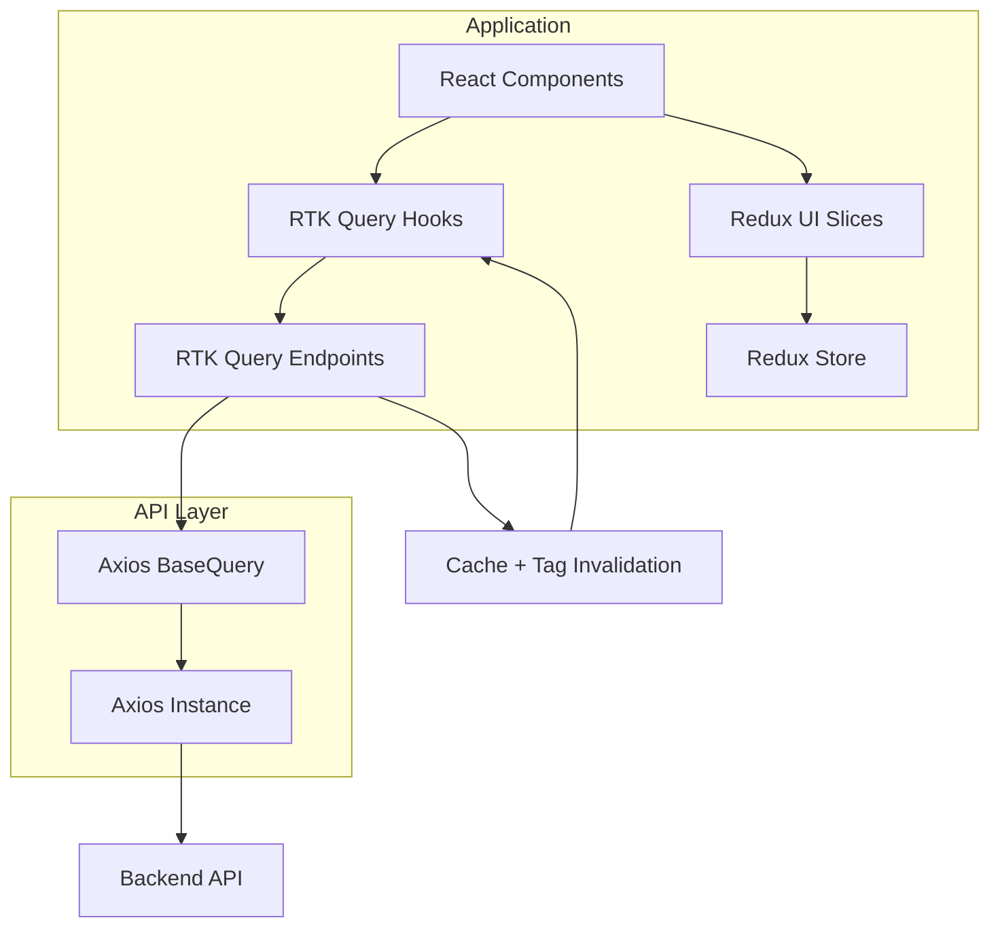

# AGENT.md — React Frontend Architecture Rules

This document defines **mandatory architectural rules** for generating and modifying frontend code.

The application uses:

- React
- Redux Toolkit
- RTK Query
- Axios
- Vite

Architecture principles:

```
Feature-based architecture
Domain-driven frontend
Event-driven UI
RTK Query for server state
Redux slices for client/UI state
Axios-powered API layer
```

---

# High-Level Architecture



---

# Project-Level vs Application-Level Configuration

## Project-Level (Repository Root)

These configure the build system.

```
vite.config.ts
tsconfig.json
package.json
eslint.config.js
```

---

## Application-Level

Lives inside:

```
src/app
```

Example:

```
src/app/
  store.ts
  routing/
  api/
    baseApi.ts
    axiosInstance.ts
    axiosBaseQuery.ts
```

---

# Source Structure

```
src/
  app/
  features/
  shared/
  assets/
  main.tsx
```

Responsibilities:

| Folder   | Responsibility             |
| -------- | -------------------------- |
| app      | application infrastructure |
| features | domain modules             |
| shared   | reusable utilities         |
| assets   | images/icons/fonts         |

---

# Entry File

```
src/main.tsx
```

Responsibilities:

```
ReactDOM render
Redux Provider
Router Provider
Application bootstrap
```

---

# Global Application Layer (`src/app`)

```
src/app/
  store.ts
  routing/
  api/
```

Responsibilities:

```
Redux store
RTK Query configuration
Axios configuration
Routing
Global providers
```

---

# Feature-Based Architecture

All business logic lives in **features**.

```
src/features/<feature>
```

Example:

```
features/
  auth/
  staff/
  students/
  courses/
```

Feature structure:

```
features/staff/
  api/
  components/
  state/
  types.ts
  events.ts
```

Rules:

```
Features must remain isolated
Features must not directly depend on other features
Shared logic belongs in shared/
```

---

# Tab Sub-Features (Feature-within-Feature)

Some features (e.g. `settings`) are composed of multiple tabs. Each tab is a **sub-feature** and must follow the same feature structure pattern.

## Sub-Feature Location

```
src/features/<feature>/tabs/<sub-feature>/
```

Example:

```
src/features/settings/tabs/
  curriculum-version/
    api/
      curriculumVersionApi.ts   — injectEndpoints into baseApi
    components/
      CurriculumVersionTab.tsx  — view only
      CurriculumVersionBanner.tsx
      CreateVersionModal.tsx    — view only
      EditVersionModal.tsx      — view only
      DeleteVersionModal.tsx    — view only
    hooks/
      useCurriculumVersionTab.ts
      useCreateVersionModal.ts
      useEditVersionModal.ts
      useDeleteVersionModal.ts
    types/
      curriculum-version.ts
    utils/
      extractNameError.ts
    index.ts                    — barrel: export { CurriculumVersionTab }
```

## Sub-Feature Rules

```
Each tab sub-feature is self-contained
API endpoints live in tabs/<sub-feature>/api/ via injectEndpoints
Components live in tabs/<sub-feature>/components/ — views only
Hooks live in tabs/<sub-feature>/hooks/ — all business logic
Types live in tabs/<sub-feature>/types/
Utils live in tabs/<sub-feature>/utils/
The parent feature's settingsApi.ts only contains shared/cross-tab endpoints
The tab component is exported via tabs/<sub-feature>/index.ts
Settings.tsx imports tabs from ../tabs/<sub-feature>
```

## Sub-Feature API Pattern

```ts
// tabs/curriculum-version/api/curriculumVersionApi.ts
const curriculumVersionApi = baseApi.injectEndpoints({
  endpoints: (builder) => ({ ... }),
});
export const { useGetCurriculumVersionsQuery, ... } = curriculumVersionApi;
```

---

# Server vs Client State

## Server State

Handled by **RTK Query**.

Examples:

```
staff
courses
students
payments
products
```

Rules:

```
Server state must never be stored in Redux slices
RTK Query cache is the single source of truth
```

---

## Client/UI State

Handled by **Redux slices**.

Examples:

```
theme
sidebar
modal
filters
```

### Slice location rules

Global UI state:

```
src/app/state
```

Feature UI state:

```
src/features/<feature>/state
```

---

# RTK Query Rules

RTK Query handles **all API communication**.

Forbidden:

```
axios inside components
fetch inside components
useEffect API calls
```

Correct usage:

```
const { data, isLoading } = useGetStaffQuery()
```

RTK Query manages:

```
caching
loading states
error states
request deduplication
refetching
```

---

# Axios API Layer

Architecture:

```
RTK Query
↓
axiosBaseQuery
↓
axiosInstance
↓
Backend API
```

---

# axiosInstance

Responsibilities:

```
base URL
authentication token
interceptors
headers
```

Example:

```ts
import axios from "axios";

export const axiosInstance = axios.create({
  baseURL: import.meta.env.VITE_API_URL,
  headers: {
    "Content-Type": "application/json",
  },
});

axiosInstance.interceptors.request.use((config) => {
  const token = localStorage.getItem("token");

  if (token) {
    config.headers.Authorization = `Bearer ${token}`;
  }

  return config;
});
```

---

# axiosBaseQuery

```ts
import { BaseQueryFn } from "@reduxjs/toolkit/query";
import { AxiosError } from "axios";
import { axiosInstance } from "./axiosInstance";

type AxiosBaseQueryArgs = {
  url: string;
  method?: "GET" | "POST" | "PUT" | "PATCH" | "DELETE";
  data?: unknown;
  params?: unknown;
};

export const axiosBaseQuery =
  (): BaseQueryFn<AxiosBaseQueryArgs, unknown, unknown> =>
  async ({ url, method = "GET", data, params }) => {
    try {
      const result = await axiosInstance({
        url,
        method,
        data,
        params,
      });

      return { data: result.data };
    } catch (error) {
      const axiosError = error as AxiosError;

      return {
        error: {
          status: axiosError.response?.status,
          data: axiosError.response?.data,
        },
      };
    }
  };
```

---

# API Tag Types (Centralized)

Tag types must be defined centrally.

Location:

```
src/shared/types/apiTagTypes.ts
```

Example:

```ts
export enum ApiTagTypes {
  Staff = "Staff",
  Student = "Student",
  Course = "Course",
  Auth = "Auth",
}
```

---

# Base API Configuration

```
src/app/api/baseApi.ts
```

Example:

```ts
import { createApi } from "@reduxjs/toolkit/query/react";
import { axiosBaseQuery } from "./axiosBaseQuery";
import { ApiTagTypes } from "@/shared/types/apiTagTypes";

export const baseApi = createApi({
  reducerPath: "api",
  baseQuery: axiosBaseQuery(),
  tagTypes: Object.values(ApiTagTypes),
  endpoints: () => ({}),
});
```

---

# Event-Driven UI Rules

Actions represent **events that already happened**.

Good:

```
userLoggedIn
staffCreated
coursePublished
productAddedToCart
```

Avoid:

```
createUser
handleSubmit
doLogin
```

Example:

```
dispatch(userLoggedIn(user))
```

---

# Side Effects Handling

Side effects should NOT be placed inside UI components.

Recommended locations:

```
RTK Query onQueryStarted
Redux Thunks
Redux Middleware
```

---

## Example: RTK Query Side Effect

```ts
createStaff: builder.mutation({
  query: (body) => ({
    url: "/staff",
    method: "POST",
    data: body,
  }),

  async onQueryStarted(arg, { dispatch, queryFulfilled }) {
    try {
      await queryFulfilled;
      dispatch(staffCreated());
    } catch {}
  },
});
```

---

## Example: Redux Thunk

```ts
export const logoutUser = () => (dispatch) => {
  localStorage.removeItem("token");

  dispatch(userLoggedOut());
};
```

---

## Example: Redux Middleware

```ts
export const analyticsMiddleware = () => (next) => (action) => {
  if (action.type === "staff/staffCreated") {
    console.log("Analytics: staff created");
  }

  return next(action);
};
```

---

# Shared Layer Rules

Shared modules must remain **domain-agnostic**.

Allowed:

```
Button
Input
Modal
Avatar
Table
```

Forbidden:

```
StaffProfileCardWithData
UserAvatarWithAPI
StudentApiHelpers
```

---

# Utility Naming Conventions

Utilities must be grouped by domain.

```
shared/utils/
  date/
    formatDate.ts
  array/
    debounce.ts
  string/
    capitalize.ts
```

Rules:

```
One utility per file
CamelCase function naming
Group by utility domain
```

---

# Types Strategy

Feature types:

```
features/<feature>/types.ts
```

Examples:

```
StaffDto
CourseDto
StudentDto
```

Shared types:

```
shared/types/
```

Examples:

```
ApiResponse
PaginationMeta
HttpMethod
```

---

# TypeScript Type vs Interface Rule

**Default: always use `type`.**

```ts
// ✅ correct
type FacultyRowProps = {
  faculty: Faculty;
  isExpanded: boolean;
};

// ❌ avoid
interface FacultyRowProps {
  faculty: Faculty;
  isExpanded: boolean;
}
```

Use `interface` only when one of these conditions is explicitly required:

| Condition | Reason |
|---|---|
| Declaration merging | Third-party library augmentation (e.g. extending `Window`, `ProcessEnv`) |
| Class `implements` contract | When a class must implement a named contract |

Rules:
```
MUST use type for all prop types, hook return shapes, API request/response shapes, and utility types
MUST use type for all types in features/<feature>/types.ts and shared/types/
MUST NOT use interface for component props
MUST NOT use interface for plain data shapes (DTOs, API params, paginated responses)
MAY use interface only for declaration merging or class implements contracts
```

---

# Asset Management

```
src/assets/
  images/
  icons/
  fonts/
```

Feature-specific assets may live inside feature folders.

---

# Styling Rules

Recommended:

```
CSS Modules
Tailwind CSS
component-scoped styling
```

Avoid:

```
global CSS overrides
inline styles
duplicate styles
```

Reusable UI components belong in:

```
shared/ui
```

---

# useToken Styling Rule (MANDATORY)

All inline style values that map to a design token MUST use `useToken()` from `@/shared/hooks/useToken`. Raw hardcoded values are only permitted when the value has no token equivalent.

```ts
import { useToken } from "@/shared/hooks/useToken";

const token = useToken();
```

## Token values to always use

| Style property | Token |
|---|---|
| Colors | `token.colorPrimary`, `token.colorError`, `token.colorBorder`, `token.colorBorderSecondary`, `token.colorBgContainer`, `token.colorBgLayout`, `token.colorTextSecondary`, `token.colorTextTertiary` |
| Border radius | `token.borderRadius` |
| Font sizes | `token.fontSize`, `token.fontSizeSM`, `token.fontSizeLG` |
| Spacing/padding | `token.paddingSM`, `token.paddingMD`, `token.paddingLG` |

## Examples

```tsx
// ✅ correct — token values
<div style={{
  border: `1px solid ${token.colorBorder}`,
  borderRadius: token.borderRadius,
  background: token.colorBgContainer,
  color: token.colorTextSecondary,
  fontSize: token.fontSizeSM,
}} />

// ❌ avoid — hardcoded values that have token equivalents
<div style={{
  border: "1px solid #d9d9d9",
  borderRadius: 6,
  background: "#ffffff",
  color: "#888",
  fontSize: 12,
}} />

// ✅ allowed — values with no token equivalent
<div style={{
  display: "flex",
  gap: 8,
  padding: "24px 16px",
  fontWeight: 600,
  whiteSpace: "nowrap",
}} />
```

## Rules

```
MUST call useToken() in any component that uses inline styles with design values
MUST use token.colorBorder (not hardcoded hex) for borders
MUST use token.colorBgContainer / token.colorBgLayout for backgrounds
MUST use token.borderRadius for border-radius
MUST use token.fontSize / token.fontSizeSM for font sizes
MAY use raw values for layout properties (display, flex, gap, padding with fixed px, fontWeight, zIndex, etc.) that have no token equivalent
MUST NOT import theme tokens from antd directly — always use the useToken hook
```

---

# Environment Variables

Location:

```
src/env.d.ts
```

Example:

```ts
interface ImportMetaEnv {
  readonly VITE_API_URL: string;
  readonly VITE_APP_NAME: string;
}

interface ImportMeta {
  readonly env: ImportMetaEnv;
}
```

Rule:

```
All VITE_ variables must be typed
```

---

# Vite Path Aliases

Example:

```ts
resolve: {
  alias: {
    "@": path.resolve(__dirname, "./src")
  }
}
```

Usage:

```
import Button from "@/shared/ui/Button"
```

Avoid:

```
../../../../Button
```

---

# Hook-Driven Architecture (Container / Presentational Pattern)

Every feature component MUST be split into two distinct files.

## The View (`[ComponentName].tsx`)

The `.tsx` file is the Presentational Component.

Rules:
```
MUST NOT contain business logic
MUST NOT contain data fetching (RTK Query hooks, axios, fetch)
MUST NOT contain complex useState or useEffect
MUST NOT contain form submission or data manipulation
MUST invoke a single custom hook at the top
MAY contain pure UI state (e.g. isDropdownOpen) — prefer moving to hook
```

## The Hook (`use[ComponentName].ts`)

The `use[ComponentName].ts` file is the Container / ViewModel.

Rules:
```
MUST handle 100% of business logic
MUST contain all API calls, side effects, and form validation
MUST return a structured object with data and functions for the View
SHOULD group return into logical sections: state, actions, flags
```

## Example Structure

```
tabs/curriculum-version/
  api/
    curriculumVersionApi.ts
  components/
    CurriculumVersionTab.tsx       — view only
    CreateVersionModal.tsx         — view only
    EditVersionModal.tsx           — view only
    DeleteVersionModal.tsx         — view only
  hooks/
    useCurriculumVersionTab.ts     — all tab logic
    useCreateVersionModal.ts       — all create logic
    useEditVersionModal.ts         — all edit logic
    useDeleteVersionModal.ts       — all delete logic
  types/
    curriculum-version.ts
  utils/
    extractNameError.ts
  index.ts
```

## Example Hook Return Shape

```ts
return {
  state: { versions, isLoading, isError, search, page },
  actions: { handleSearchChange, handleActivate, setPage },
  flags: { hasData: versions.length > 0 },
};
```

---

## Entity Hook Grouping Rule (MANDATORY)

All CRUD modal logic for the same entity MUST be grouped into a single hook file named `use{Entity}Modal.ts`. Do NOT create separate files per operation (`useCreateX`, `useEditX`, `useDeleteX`).

### File naming

```
hooks/
  useFacultyModal.ts      — useFacultyFormModal, useDeleteFacultyModal
  useDepartmentModal.ts   — useDepartmentFormModal, useDeleteDepartmentModal
```

### Upsert Pattern (MANDATORY for Create + Edit)

Create and Edit operations for the same entity MUST share a single modal component and a single hook using the **upsert pattern**:

- `target === null` → create mode
- `target !== null` → edit mode

The hook detects the mode and calls the correct mutation. The component renders the correct title and submit label based on `isEditMode`.

```ts
// hook — useFacultyModal.ts
export function useFacultyFormModal(target: Faculty | null, open: boolean, onClose: () => void) {
  const isEditMode = target !== null;
  // calls createFaculty when isEditMode=false, updateFaculty when isEditMode=true
  return { state: { isEditMode, ... }, actions: { handleSubmit, handleCancel }, form };
}
```

```tsx
// component — FacultyFormModal.tsx
<FacultyFormModal open={open} target={null} onClose={onClose} />       // create
<FacultyFormModal open={open} target={faculty} onClose={onClose} />    // edit
```

### Modal file naming

```
components/modals/
  FacultyFormModal.tsx     — create + edit faculty (upsert)
  DeleteFacultyModal.tsx   — delete faculty confirmation
  DepartmentFormModal.tsx  — create + edit department (upsert)
  DeleteDepartmentModal.tsx — delete department confirmation
```

### Structure within the hook file

```ts
// ─── Upsert (Create / Edit) ───────────────────────────────────────────────────
export function useFacultyFormModal(...) { ... }

// ─── Delete ───────────────────────────────────────────────────────────────────
export function useDeleteFacultyModal(...) { ... }
```

### When to break into a separate file

Only split into a separate hook file when:
- The hook has significant independent complexity (e.g. `useFacultyRow`, `useHierarchyView`)
- The hook is reused across multiple features
- The hook manages page-level or list-level state (not modal state)

### Rules

```
MUST use upsert pattern — one form modal component handles both create and edit
MUST group upsert hook and delete hook for the same entity in one file
MUST name the file use{Entity}Modal.ts
MUST name the modal component {Entity}FormModal.tsx
MUST NOT create separate CreateX.tsx and EditX.tsx modal components
MUST NOT create useCreateX.ts, useEditX.ts as separate files for modal logic
MAY keep page/list/row hooks (useHierarchyView, useFacultyRow) as separate files
```

---

# Testing Strategy

Testing expectations:

| Layer            | Test Type         |
| ---------------- | ----------------- |
| Redux slices     | unit tests        |
| API endpoints    | integration tests |
| React components | component tests   |

Recommended tools:

```
Vitest
React Testing Library
MSW
```

---

# Performance Rules

Use RTK Query features:

```
automatic caching
background refetching
request deduplication
tag invalidation
```

Avoid:

```
manual polling loops
duplicate API calls
global loading flags
```

---

# Data Flow

Query flow:

```
Component
↓
RTK Query Hook
↓
RTK Endpoint
↓
Axios BaseQuery
↓
Axios Instance
↓
Backend API
```

Mutation flow:

```
Form
↓
RTK Mutation
↓
API Request
↓
Cache Invalidation
↓
Automatic Refetch
```

---

# Error Handling Rule

All RTK Query mutation errors in hooks MUST be handled using `parseApiError` from `@/shared/utils/error/parseApiError`.

## Imports

```ts
import { applyFormErrors } from "@/shared/utils/error/applyFormErrors";
import { parseApiError } from "@/shared/utils/error/parseApiError";
```

## Standard catch block pattern

Every catch block MUST call `notification.error` first, then apply form/field errors.

For hooks with a form:

```ts
import { notification } from "antd";
import { applyFormErrors } from "@/shared/utils/error/applyFormErrors";
import { parseApiError } from "@/shared/utils/error/parseApiError";

} catch (err: unknown) {
  const parsed = parseApiError(err);
  notification.error({ message: parsed.message });
  applyFormErrors(parsed, form, setFormError);
}
```

For hooks without a form (e.g. delete modals):

```ts
import { notification } from "antd";
import { parseApiError } from "@/shared/utils/error/parseApiError";

} catch (err: unknown) {
  const parsed = parseApiError(err);
  notification.error({ message: parsed.message });
  setError(parsed.message);
}
```

## Rules

```
MUST call notification.error({ message: parsed.message }) in every catch block
MUST parse the error once: const parsed = parseApiError(err) — do NOT call parseApiError twice
MUST use applyFormErrors(parsed, form, setFormError) for form hooks
MUST use setError(parsed.message) for non-form hooks (delete modals)
MUST NOT use hardcoded fallback error strings
MUST NOT use extractNameError (removed — replaced by parseApiError)
MUST NOT write custom error parsing logic in hooks or components
MUST NOT manually iterate fieldErrors — use applyFormErrors instead
parseApiError always returns a non-null ParsedApiError — no null checks needed
message is always a non-empty string — safe to display directly
```

## ParsedApiError shape

```ts
{
  type: ApiErrorType;          // error category enum
  status: number;              // HTTP status code
  message: string;             // user-facing message, never empty
  fieldErrors: Record<string, string>;  // field → message map, {} when none
  raw: ApiErrorBody;           // original parsed body
}
```

---

# Access Control Rule (MANDATORY)

All permission checks and UI guards MUST use the `access-control` feature. Never implement custom permission logic, role checks, or visibility guards outside of this feature.

## Public API — always import from `@/features/access-control`

| Export | Purpose |
|---|---|
| `PermissionGuard` | Declarative component that hides children when user lacks permission |
| `useAccessControl()` | Hook for imperative permission checks in hooks/logic |
| `Permission` | Const object of all permission strings — never use raw strings |
| `useAccessControl().activeRole` | Read `scope` and `scopeReferenceId` for scope-aware logic |

## Declarative guard in components (MANDATORY)

```tsx
import { PermissionGuard } from "@/features/access-control";
import { Permission } from "@/features/access-control/permissions";

// Single permission
<PermissionGuard permission={Permission.FacultiesCreate}>
  <Button>Create Faculty</Button>
</PermissionGuard>

// Multiple — any one required (default)
<PermissionGuard permission={[Permission.FacultiesUpdate, Permission.FacultiesManage]}>
  <EditButton />
</PermissionGuard>

// Multiple — all required
<PermissionGuard permission={[Permission.FacultiesCreate, Permission.FacultiesManage]} requireAll>
  <AdminButton />
</PermissionGuard>

// With fallback
<PermissionGuard permission={Permission.FacultiesDelete} fallback={<DisabledButton />}>
  <DeleteButton />
</PermissionGuard>
```

## Imperative checks in hooks (MANDATORY)

```ts
import { useAccessControl } from "@/features/access-control";
import { Permission } from "@/features/access-control/permissions";

const { hasPermission, hasAnyPermission, activeRole } = useAccessControl();

// Single check
const canEdit = hasPermission(Permission.FacultiesUpdate);

// Scope-aware check (e.g. Dean restricted to own faculty)
const canEditDept = activeRole?.scope === "FACULTY"
  ? hasPermission(Permission.DepartmentsUpdate) && dept.facultyId === activeRole.scopeReferenceId
  : hasPermission(Permission.DepartmentsUpdate);
```

## Rules

```
MUST import PermissionGuard from @/features/access-control — never create a new one
MUST import Permission from @/features/access-control/permissions — never use raw permission strings
MUST use useAccessControl() for all imperative permission checks in hooks
MUST NOT hardcode role names (e.g. "System Administrator", "Dean") in components or hooks
MUST NOT write custom permission logic outside of the access-control feature
MUST derive scope restrictions from activeRole.scope and activeRole.scopeReferenceId
MUST NOT add new permissions to permissions.ts without updating the access-control feature
```

---

# Forbidden Patterns

Agents must NEVER generate:

```
axios inside components
server state in Redux slices
business logic inside UI
duplicate API clients
untyped API responses
```

---

# Architecture Summary

```
React → UI
Redux Toolkit → client state
RTK Query → server state
Axios → HTTP
Vite → bundler
```

Architecture style:

```
Feature-based
Domain-driven
Event-driven
```

Benefits:

```
scalable
maintainable
predictable state management
clean domain boundaries
```

---

# Feature UI/UX Rules

## Purpose
This section defines **standard UI/UX rules and principles** for building consistent, scalable, and user-friendly frontend features.

---

## Core Principles

### 1. Clarity Over Complexity
- Keep UI simple and intuitive
- Avoid unnecessary elements
- Use clear, user-friendly labels

### 2. Consistency
- Reuse patterns across features
- Maintain uniform spacing, typography, and actions

### 3. Feedback & Responsiveness
- Always show:
  - Loading states
  - Success states
  - Error states

### 4. Progressive Disclosure
- Show only what is necessary
- Hide advanced options until needed

---

## Feature Structure Standard

### 1. Overview (Dashboard Section)
Each feature MUST include:
- Metrics cards
- Status indicators
- Quick actions (e.g., "Create")

### 2. Explorer (Feature Introduction)
Each feature MUST include:
- What the feature does
- Why it matters
- How to use it

---

## Data Display Rules

### 1. Small Data Sets → List Component
Use List when:
- ≤ 4–5 fields
- Simple structure

### 2. Large Data Sets → Table Component
Use Table when:
- > 5 fields
- Structured data

**Table Requirements:**
- Sortable columns
- Pagination
- Filtering/search

### 3. Fixed Columns
Use sticky/fixed columns when:
- Key identifiers (e.g., Name, ID) must remain visible
- Horizontal scrolling exists

### 4. Mobile Responsiveness (MANDATORY)

On mobile screens, tables MUST:
- Support **horizontal scrolling**, OR
- Automatically transform into a **stacked list/card layout**

**Preferred priority:**
1. Stacked list (best UX)
2. Horizontal scroll (fallback)

**Rules:**
- Never break layout
- Never truncate critical data without access
- Maintain action accessibility

---

## Actions & Interaction Rules

### 1. Action Placement
- Primary actions → top right
- Row actions → right side

### 2. Action Density Rule (IMPORTANT)

- If actions ≤ 2 → show inline (icons or buttons)
- If actions > 2 → use **three vertical dots (⋮) dropdown menu**

**Dropdown Requirements:**
- Clearly labeled actions
- Group destructive actions (e.g., Delete) separately
- Maintain consistent ordering across app

### 3. Inline Actions
- Allow quick edit/delete where possible
- Avoid unnecessary navigation

### 4. Confirmation Patterns
Use confirmation for:
- Delete
- Critical updates

---

## Create / Edit Patterns

### Modal-First Approach (MANDATORY)

All Create operations MUST use modals.

### Modal Sizing Rules

| Form Size | UI Pattern |
|---|---|
| ≤ 6 fields | Small Modal |
| 6–12 fields | Large Modal |
| Complex/Multi-step | Full Page |

### Modal UX Requirements
- Clear title
- Primary CTA (Save/Create)
- Secondary CTA (Cancel)
- Inline validation
- Loading state on submit

---

## Form Design Rules

### Validation
- Validate early
- Show clear error messages

### Form Validation Utils (MANDATORY)

Every feature that contains forms MUST have a dedicated validation utility file:

```
features/<feature>/utils/validators.ts
```

Rules:
```
MUST export AntD Rule arrays (Rule[]) — not inline validation logic
MUST use custom regex where format constraints apply (e.g. codes, slugs)
MUST NOT duplicate validation logic across hooks or components
MUST NOT define rules inline inside JSX or hook files
Components and hooks MUST import rules from the feature's validators.ts
```

Example structure:

```ts
// features/academic-structure/utils/validators.ts
import type { Rule } from "antd/es/form";

export const nameRules: Rule[] = [
  { required: true, message: "Name is required" },
  { max: 150, message: "Name must be 150 characters or fewer" },
];

export const codeRules: Rule[] = [
  { required: true, message: "Code is required" },
  {
    pattern: /^[A-Za-z0-9_]{1,20}$/,
    message: "Code must be 1–20 characters. Only letters, numbers, and underscores are allowed.",
  },
];
```

Usage in components:

```tsx
import { nameRules, codeRules } from "../utils/validators";

<Form.Item name="name" rules={nameRules}>
  <Input />
</Form.Item>
<Form.Item name="code" rules={codeRules}>
  <Input />
</Form.Item>
```

### Field Types
- Select → predefined values
- Toggle → boolean
- Text → free input

### Grouping
- Group related fields
- Use sections when needed

---

## State Handling

### 1. Empty State
- Helpful message
- CTA (e.g., "Create first item")

### 1a. Conditional Rendering — Use `ConditionalRenderer` (MANDATORY)

Never write `{condition && (<div>...</div>)}` inline blocks in JSX. Use the shared `ConditionalRenderer` wrapper instead.

```
src/shared/ui/ConditionalRenderer.tsx
```

Props:

| Prop | Type | Required | Description |
|---|---|---|---|
| `when` | `boolean` | yes | Renders children only when `true` |
| `children` | `ReactNode` | yes | Content to render |
| `wrapper` | `(children: ReactNode) => ReactNode` | no | Optional container wrapper |

Basic usage:

```tsx
import { ConditionalRenderer } from "@/shared/ui/ConditionalRenderer";

<ConditionalRenderer when={!hasData && !isSearchActive}>
  <EmptyState />
</ConditionalRenderer>
```

With a styled container using the `centeredBox` helper:

```tsx
import { ConditionalRenderer, centeredBox } from "@/shared/ui/ConditionalRenderer";

<ConditionalRenderer
  when={!hasData && !isSearchActive}
  wrapper={centeredBox({
    border: `1px dashed ${token.colorBorder}`,
    borderRadius: token.borderRadius,
    background: token.colorBgContainer,
  })}
>
  <Typography.Text type="secondary">No items yet.</Typography.Text>
  <Button type="primary" onClick={handleCreate}>Create</Button>
</ConditionalRenderer>
```

Rules:
```
MUST use ConditionalRenderer instead of inline {condition && (...)} blocks in view components
MUST NOT use ternary {condition ? <A /> : <B />} for multi-line JSX blocks — use two ConditionalRenderers
Use the centeredBox helper for empty/no-results states that need a centred container
wrapper prop accepts any function returning ReactNode — use for custom containers
```

### 2. Loading State — Use `DataLoader` (MANDATORY)

Never write `if (isLoading) return <Spinner />` or ternary loading checks inside view components. Use the shared `DataLoader` wrapper instead.

```
src/shared/ui/DataLoader.tsx
```

Props:

| Prop | Type | Required | Default |
|---|---|---|---|
| `loading` | `boolean` | yes | — |
| `loader` | `ReactNode` | no | AntD `<Spin />` centered |
| `children` | `ReactNode` | yes | — |
| `className` | `string` | no | — |
| `minHeight` | `string \| number` | no | `"120px"` |

Default usage (AntD spinner):

```tsx
import { DataLoader } from "@/shared/ui/DataLoader";

<DataLoader loading={isLoading}>
  <MyContent />
</DataLoader>
```

Custom skeleton loader:

```tsx
<DataLoader loading={isLoading} loader={<MySkeletonRows />}>
  <MyContent />
</DataLoader>
```

For list/table loading states, use the shared `SkeletonRows` component instead of writing inline skeleton JSX:

```
src/shared/ui/SkeletonRows.tsx
```

Props:

| Prop | Type | Default | Description |
|---|---|---|---|
| `count` | `number` | `3` | Number of skeleton rows |
| `variant` | `"card" \| "inline"` | `"card"` | `card` = bordered card rows (top-level lists); `inline` = borderless bottom-border rows (nested/inline lists) |

```tsx
import { SkeletonRows } from "@/shared/ui/SkeletonRows";

// Top-level list (bordered cards)
<DataLoader loading={isLoading} loader={<SkeletonRows />}>
  <MyList />
</DataLoader>

// Nested/inline list (e.g. rows inside an expanded section)
<DataLoader loading={isLoading} loader={<SkeletonRows count={3} variant="inline" />} minHeight="80px">
  <MyNestedList />
</DataLoader>
```

Rules:
```
MUST use SkeletonRows for list/table loading skeletons — no inline skeleton JSX
MUST pass SkeletonRows via the loader prop of DataLoader
Use variant="card" for top-level bordered list rows (default)
Use variant="inline" for nested rows inside expanded sections
```

Rules:
```
MUST use DataLoader for any section or page with a loading state
MUST NOT use inline if (isLoading) return ... in view components
MUST NOT use ternary {isLoading ? <Spinner /> : <Content />} in JSX
Custom loaders (skeletons, shimmer rows) are passed via the loader prop
DataLoader renders children directly when loading is false — no extra wrapper
```

### 3. Error State
- Clear message
- Retry option

### 3a. Error Alerts — Use `ErrorAlert` (MANDATORY)

Never write inline `{error && <Alert type="error" ... />}` in view components or modals. Use the shared `ErrorAlert` component instead.

```
src/shared/ui/ErrorAlert.tsx
```

Props:

| Prop | Type | Default | Description |
|---|---|---|---|
| `error` | `string \| null \| undefined` | — | Renders nothing when falsy |
| `variant` | `"form" \| "section"` | `"form"` | `form` = compact with marginBottom (modals/forms); `section` = full-width with retry (page/section fetch errors) |
| `onRetry` | `() => void` | — | Renders a Retry button in `section` variant |
| `action` | `ReactNode` | — | Custom action node, overrides default Retry button |

Form error (inside modal/form body):

```tsx
import { ErrorAlert } from "@/shared/ui/ErrorAlert";

<ErrorAlert error={formError} />
```

Section fetch error (with retry):

```tsx
<ErrorAlert variant="section" error="Failed to load items" onRetry={refetch} />
```

Rules:
```
MUST use ErrorAlert for all error display in view components and modals
MUST NOT use inline {error && <Alert type="error" ... />} patterns
MUST NOT import Alert from antd for error display — use ErrorAlert
Use variant="form" (default) inside modal/form bodies
Use variant="section" for section or page-level fetch errors with a retry action
ErrorAlert renders nothing when error is null/undefined/empty — no extra conditional needed
```

---

## Performance Rules
- Use pagination for large data
- Avoid over-fetching
- Cache where possible

---

## Accessibility Rules
- Keyboard navigation support
- Proper labels
- Good contrast ratios

---

## UX Enhancements

### Search & Filters
- Required for large datasets

### Filter Panel — Use Popover for Multiple Filters (MANDATORY)

When a feature has **2 or more filter inputs**, they MUST be grouped inside an AntD `Popover` triggered by a single "Filters" button. Do NOT render multiple filter `Select` components inline in the toolbar.

**Trigger button requirements:**
- Label: "Filters" with a `FilterOutlined` icon
- Use AntD `Badge` to show the count of active filters on the button
- Button type switches to `"primary"` when any filter is active, `"default"` otherwise

**Popover content requirements:**
- Fixed width (e.g. `280px`)
- Use `Form layout="vertical"` with labeled `Form.Item` wrappers for each filter
- Each filter is a `Select` with `allowClear`
- Include a "Clear all filters" `Button type="link"` at the bottom, visible only when `activeFilterCount > 0`
- `arrow={false}` on the Popover

**Example:**

```tsx
import { useState } from "react";
import { Badge, Button, Flex, Form, Popover, Select } from "antd";
import { FilterOutlined } from "@ant-design/icons";

const [filterOpen, setFilterOpen] = useState(false);

const activeFilterCount = [statusFilter, typeFilter].filter((v) => v !== undefined).length;

const filterContent = (
  <Flex vertical gap={16} style={{ width: 280 }}>
    <Form layout="vertical" size="middle">
      <Form.Item label="Status" style={{ marginBottom: 12 }}>
        <Select
          placeholder="Any status"
          allowClear
          value={statusFilter}
          onChange={handleStatusFilterChange}
          style={{ width: "100%" }}
          options={STATUS_OPTIONS}
        />
      </Form.Item>
      <Form.Item label="Type" style={{ marginBottom: 0 }}>
        <Select
          placeholder="Any type"
          allowClear
          value={typeFilter}
          onChange={handleTypeFilterChange}
          style={{ width: "100%" }}
          options={TYPE_OPTIONS}
        />
      </Form.Item>
    </Form>
    {activeFilterCount > 0 && (
      <Button type="link" size="small" onClick={clearAllFilters} style={{ padding: 0 }}>
        Clear all filters
      </Button>
    )}
  </Flex>
);

<Popover
  content={filterContent}
  title={<span><FilterOutlined /> Filters</span>}
  trigger="click"
  open={filterOpen}
  onOpenChange={setFilterOpen}
  placement="bottomLeft"
  arrow={false}
>
  <Badge count={activeFilterCount} size="small">
    <Button icon={<FilterOutlined />} type={activeFilterCount > 0 ? "primary" : "default"}>
      Filters
    </Button>
  </Badge>
</Popover>
```

**Rules:**
```
MUST use a Popover-based filter panel when there are 2 or more filter inputs
MUST NOT render multiple filter Select components inline in the toolbar
MUST show active filter count as a Badge on the trigger button
MUST switch button type to "primary" when any filter is active
MUST include a "Clear all filters" link inside the popover when activeFilterCount > 0
MUST use Form layout="vertical" with Form.Item labels inside the popover
MUST use arrow={false} on the Popover
MAY keep a single filter Select inline in the toolbar if there is only one filter
```

### Sorting
- Default meaningful sort
- Allow override

### Tooltips
- Use for icons or complex info

---

## UI/UX Anti-Patterns (Avoid)

```
❌ Full-page forms for simple create
❌ Tables for small datasets
❌ Too many fields in one view
❌ No user feedback
❌ Hidden critical actions
```

---

## UI/UX Summary Checklist

```
✔ Dashboard + Explorer present
✔ Create uses Modal
✔ Small data → List
✔ Large data → Table
✔ Tables responsive (stack/scroll)
✔ Actions follow dropdown rule
✔ States handled properly (DataLoader for loading, empty state, error state)
✔ UI consistent
```

---

# End of AGENT.md
